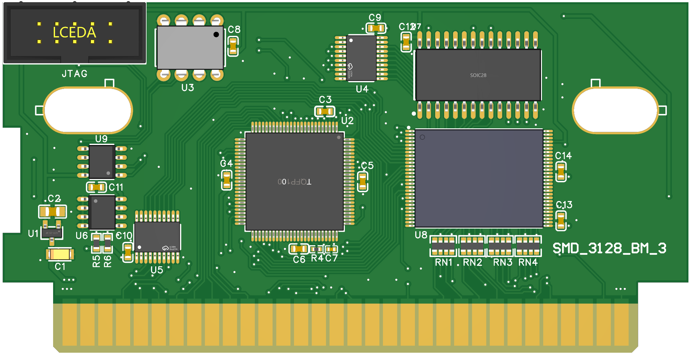

# SMD_3128_BM_3

SEGA Genesis/MegaDrive/32X reproduction cartridge with support for multiple mappers. CPLD configurations are backward compatible with cheap chinese reproduction PCB's labeled "SMD_3128_BM" found on Aliexpress.

## Hardware
The [porject file](src/EasyEDA_Pro_SMD_3128_BM_3.epro) can be opened using the [EasyEDA Pro](https://pro.easyeda.com/editor).
Click on "File"-> "Import" -> "EasyEDA(Professional)..." to import project file.

Generated gerber files: [Gerber](gerbers/Gerber_SMD_3128_BM_3_rev0.zip)
PCB schematic file: [Schematic](info/Schematic.pdf)

PCB thickness: 1.6mm
Hard Gold or ENIG surface finish is recommended.

## Firmware
MAX3128 CPLD firmware can be compiled using the Quartus 13.0. It's the latest version that supports 3000 series chips.

You need to select required mapper in [top module](src/cpld/SMD_3128_BM_3.v). Only one mapper at a time is currently supported.

There is JTAG connector on the board to connect Altera USB Blaster programmer.

## Mappers
Compiled mappers are located in the [mappers](mappers/) directory.

### mapper_PierSolar.pof
* Pier Solar and The Great Architects

### mapper_SSF2.pof
* Super Street Fighter 2
* Earthion
* Sonic Delta (hack)
* Demons of Asteborg
* Astebros 
* Daemon Claw - Origins of Nnar
* Doom Resurrection (32X)(hack)

### mapper_flat_64.pof
* Mortal Kombat Ultimate (hack)
* FX-Unit Yuki: Henshin Engine

### mapper_flat_80.pof
* Mortal Kombat Trilogy (hack)

### mapper_multigame_128k.pof
* Radica-like pirate multigame carts with parallel bank load, 128kB page size (Max.supported ROM size is 32MB)

### mapper_multigame_512k.pof
* Pirate multigame carts with serial bank load, 512kB page size

### mapper_I2C_Acclaim.pof
* NBA Jam (JUE)

### mapper_I2C_EA.pof
* NHLPA Hockey 93 (UE)
* Rings of Power (UE)
* John Madden Football 93
* Bill Walsh College Football

### mapper_I2C_SEGA.pof
* Evander 'Real Deal' Holyfield's Boxing
* Greatest Heavyweights of the Ring (JUE)
* Wonder Boy in Monster World (UE)/Wonder Boy V - Monster World III (J)
* Sports Talk Baseball
* Honoo no Toukyuuji Dodge Danpei
* Ninja Burai Densetsu
* Game Toshokan
* Megaman - The Wily Wars (E)/Rockman Mega World (J)(alt)

### mapper_I2C_Codemasters.pof
* Micro Machines 2 - Turbo Tournament (E)
* Micro Machines Military (E)
* Micro Machines Turbo Tournament 96 (E)
* Brian Lara Cricket
* Brian Lara Cricket 96 / Shane Warne Cricket